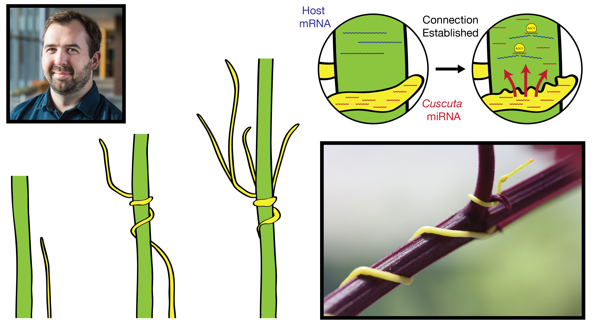

--- 
---

Computational plant biologist interested in small RNAs and their role in inter-species competition. 

Currently, I'm finishing my Ph.D. in Plant Biology at Penn State, working with [Mike Axtell](https://sites.psu.edu/axtell/). I'm broadly interested in plant biology and currently looking for positions where I can use sequencing data and modern analysis techniques to better understand how plants function and interact with the world.

[Link to my GitHub page](https://github.com/NateyJay) 
[Link to my current CV](./files/N\ Johnson\ CV\ Nov-2018.pdf) (Current as of Nov-2018) 
[ORCID number](https://orcid.org/0000-0002-5279-9964) 

Contact: 
<jax523@gmail.com> 
1-(586)-337-0532 

